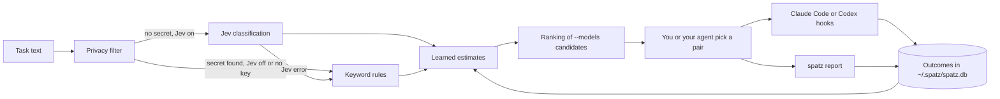

# spatz

spatz recommends a model and effort pair for a coding-agent task, and learns which pairs succeed.

The motto is: do not use a cannon to shoot sparrows. Do not use the strongest model when a cheaper model is good enough.

## Status

spatz is a proof of concept. Expect changes to commands, output and the database schema.

What works:

- Recommendations from the candidates that you give with `--models`.
- Task classification with Jev, or with local keyword rules when Jev is off.
- Learning from Claude Code and Codex CLI hooks, and from `spatz report`.
- Statistics per task type with `spatz stats`.

What does not work yet:

- Signal collection works only with Claude Code and Codex CLI hooks. Other coding agents can only use `spatz report`.
- There is no MCP server.
- There is no npm package. Use a release archive or a repository clone.

## How it works

You give spatz a task text and a list of candidate pairs. A local filter first checks the task text for secrets. If the filter finds no secret, Jev classifies the task. The classification gives a task type, a difficulty and a criticality. Jev is a TypeSafe AI model that returns typed answers with calibrated probabilities. spatz then reads the learned success estimates for each candidate in that task class and ranks the candidates. spatz never runs the task and never switches the model. You or your agent pick the model. Claude Code hooks and `spatz report` send the outcome back, and spatz updates its estimates.



[docs/how-it-works.md](docs/how-it-works.md) and [docs/recommendation.md](docs/recommendation.md) explain the details.

## Requirements

- Bun 1.4 for development or installation from source. Release archives include the runtime.
- Optional: a TypeSafe AI API key for Jev classification. Jev is in early access.

spatz works without a key. Without a key, spatz uses the keyword rules. These rules set only the criticality. The task type is always `other`.

## Releases

Download an archive and its matching `.sha256` file from [GitHub Releases](https://github.com/lorenzh/spatz/releases).
Choose `linux` or `darwin` (macOS), then `x64` (Intel/AMD) or `arm64` (including Apple Silicon).
Linux builds need glibc. They do not support Alpine Linux.

Check the checksum before you extract the archive. This Linux x64 example uses version `0.1.0`. Use your downloaded version:

```bash
version=0.1.0
archive="spatz-cli-$version-linux-x64.tar.gz"
sha256sum --check "$archive.sha256"
```

On macOS, use `shasum -a 256 --check "$archive.sha256"` and a `darwin` archive.
The release also contains `SHA256SUMS` with checksums for all archives.

Keep the archive contents together. Put a symlink to the executable on your `PATH`:

```bash
mkdir -p ~/.local/lib/spatz ~/.local/bin
tar -xzf "$archive" -C ~/.local/lib/spatz
ln -sfn "$HOME/.local/lib/spatz/${archive%.tar.gz}/spatz" ~/.local/bin/spatz
export PATH="$HOME/.local/bin:$PATH"
spatz --version
```

If needed, add the `PATH` line to your shell profile.
Each archive includes `spatz`, `LICENSE`, `README.md`, the DuckDB binding, and the DuckDB shared library.
`spatz stats` needs the binding and shared library beside the executable.
On first use, it downloads DuckDB's SQLite extension into `~/.spatz/duckdb-extensions`.
Later runs can use that extension offline.

The fixed [`nightly` release](https://github.com/lorenzh/spatz/releases/tag/nightly) is unstable.
When `main` has a new commit, it updates daily at 03:00 UTC.
You can also start a manual workflow run.
See [RELEASING.md](RELEASING.md) for the release procedure.

## Install and quickstart

1. Clone the repository and install the dependencies.

   ```bash
   git clone https://github.com/lorenzh/spatz.git
   cd spatz
   bun install
   ```

2. Put `spatz` on your `PATH` with a small wrapper. Hooks run in a non-interactive shell, so a shell alias does not work.

   ```bash
   mkdir -p ~/.local/bin
   printf '#!/bin/sh\nexec bun "%s/packages/cli/src/cli.ts" "$@"\n' "$PWD" > ~/.local/bin/spatz
   chmod +x ~/.local/bin/spatz
   ```

3. Optional: set your TypeSafe AI key to turn on Jev.

   ```bash
   export TYPESAFE_AI_API_KEY=<your-key>
   ```

4. Ask for a recommendation. `--models` lists the pairs that you can use, in the form `<id>[:<effort>+<effort>...]`.

   ```bash
   spatz "Fix the off-by-one error in src/list.ts" \
     --models claude-opus-5-5:high+medium,claude-sonnet-5-5:medium+low --dry-run
   ```

   Example output without a key (`SPATZ_NO_JEV=1`, empty database):

   ```text
   suggestion_id: fd8b7c1f-1f93-44f6-ac7b-b77ee287d1bb
   1. anthropic/claude-opus-5.5:high  estimate=0.50  n=0
   reason: Without Jev and learned data the most expensive pair anthropic/claude-opus-5.5 (high) is recommended.
   task_type: other  difficulty: medium  criticality: none
   explored: false  control: false  fallback_used: true  (dry-run)
   ```

   `--dry-run` marks the recommendation as a test. A test never counts for learning or statistics. Remove the flag for real use.

   spatz gets model prices from the OpenRouter model list and keeps them for 24 hours in `~/.spatz/openrouter-models.json`. To fill this cache, spatz needs network access. Without network access, you still get a recommendation. spatz uses the cached prices, even from a stale cache. If no cache exists, all prices are unknown and the models rank as most expensive.

5. After the task, report the pair that you used and the result.

   ```bash
   spatz report <suggestion_id> --model claude-sonnet-5-5 --effort medium --result pass
   ```

   A report overrides all hook signals for that recommendation.

## Use with Claude Code

You can connect spatz to Claude Code in three ways. They can run alone or together.

- **Hooks only.** The hooks in your Claude Code settings watch Bash calls and record test and build results, models and tokens. See [docs/hooks.md](docs/hooks.md).
- **Mod only.** The `spatz` mod in `packages/claude-mod` asks spatz for each decision. In `apply` mode it sets model and effort for subagents or for the main session. It records usage itself. See [docs/claude-mod.md](docs/claude-mod.md).
- **Both.** The mod routes and the hooks record. With `record: auto` the mod stops recording when the `spatz-hooks` plugin is enabled, so nothing is counted twice.

The mod has five routing scopes: `step`, `turn`, `subagent` (default), `session` and `escalate`. `spatz stats --by scope` compares them.

## Commands

The suggestion, report, usage, link and stats commands accept `--json` for machine-readable output.

| Command | Purpose |
| --- | --- |
| `spatz --version` | Print the CLI version. |
| `spatz "<task>" --models <list> [--scope <scope>] [--session <id>] [--turn <id>] [--agent-id <id>] [--source <agent>] [--dry-run]` | Rank candidate pairs and optionally store routing attribution. |
| `spatz report <suggestion_id> --model <m> --effort <e> --result pass\|partial\|fail [--rounds <n>] [--note <t>] [--turn <id> --source claude-code-mod]` | Record the pair that you used and the result. |
| `spatz usage <suggestion_id> ... --turn <id> --source claude-code-mod` | Record direct model usage and token counts. |
| `spatz link <suggestion_id> --agent-id <id> --session <id>` | Link a subagent suggestion after its id is known. |
| `spatz hook <event> [--agent codex]` | Read a Claude Code or Codex hook event from stdin. Prints nothing and always exits 0. |
| `spatz stats [--type <t>] [--by scope]` | Show results per task type or routing scope. |

Exit codes: 0 for success, 1 for a runtime error (for example an unknown `suggestion_id`), 2 for a usage error. [docs/cli.md](docs/cli.md) is the full reference.

## Configuration and privacy

spatz reads four environment variables. `HOME` sets the location of `~/.spatz`. `TYPESAFE_AI_API_KEY` turns on Jev. `SPATZ_NO_JEV=1` turns off Jev. If you set `OPENROUTER_API_KEY`, spatz sends it with the OpenRouter model-list request. A project can also turn off Jev with `{"jev": false}` in `.spatz.json` in the working directory. All data stays in `~/.spatz`. [docs/configuration.md](docs/configuration.md) lists all settings and files.

When Jev is on, spatz sends the task text and the candidate list to TypeSafe AI. The candidate list holds the `model:effort` labels and a short description per model. If Jev is off, the key is missing or the secret filter finds a secret, spatz sends nothing to TypeSafe AI. spatz does not store the task text. The OpenRouter model-list request holds no task data. Turning off Jev does not stop this request. The hooks store only derived signals, model names, efforts and token counts. [docs/privacy.md](docs/privacy.md) describes each data flow.

## Documentation

- [docs/how-it-works.md](docs/how-it-works.md): the architecture and the flow from task to outcome.
- [docs/recommendation.md](docs/recommendation.md): how spatz ranks candidates, explores and uses control groups.
- [docs/privacy.md](docs/privacy.md): what data leaves your machine and what spatz stores.
- [docs/cli.md](docs/cli.md): all commands, flags, output fields and exit codes.
- [docs/hooks.md](docs/hooks.md): the Claude Code hooks setup and the signals they record.
- [docs/claude-mod.md](docs/claude-mod.md): the Claude Code mod, its modes, routing scopes and `/spatz` commands.
- [docs/configuration.md](docs/configuration.md): environment variables, project file and files in `~/.spatz`.
- [CONTRIBUTING.md](CONTRIBUTING.md): development setup, tests and the change process.
- [SECURITY.md](SECURITY.md): how to report a vulnerability.

## Development

The repository is a Bun workspace with two packages. `packages/core` (`@spatz/core`) holds all logic. `packages/cli` (`@spatz/cli`) is a thin CLI on top of it.

Run these gates before you push:

```bash
bun test            # all tests, including end-to-end tests of the CLI
bun run typecheck   # tsc --noEmit
bun run lint        # biome check
```

Work test first. Write a failing test and make it pass with the minimum code. Then clean up. [CONTRIBUTING.md](CONTRIBUTING.md) has the details.

## License

MIT. See [LICENSE](LICENSE).
