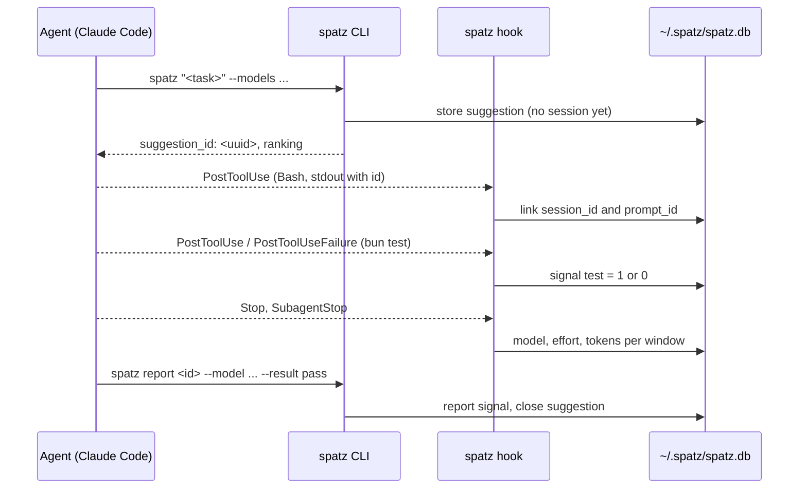

# Claude Code hooks for spatz

spatz learns which pair of model and effort succeeds. It needs results for that. Claude Code hooks give spatz these results without extra work from the agent: test and build results, and the models and tokens the session used. `spatz report` gives an explicit result. A report wins over the hook signals for its selected attempt.

The hooks never block a session. `spatz hook` always exits with code 0 and prints nothing by default.
With `SPATZ_DEBUG=1`, the hook writes diagnostics to stderr. It still ignores all errors.
The snippet below also runs each hook with `"async": true`, so Claude Code does not wait for it.

spatz supports Claude Code and Codex CLI. For the command reference see [cli.md](cli.md).

## Install the hooks

### Marketplace plugin

Run these commands in Claude Code. See the [installation guide](installation.md) for runtime requirements:

```text
/plugin marketplace add lorenzh/spatz
/plugin install spatz@spatz
```

The plugin runs the four commands below with the same matchers and `async: true`.
It calls `sh "${CLAUDE_PLUGIN_ROOT}/bin/spatz"` using [Claude Code's plugin-root variable](https://code.claude.com/docs/en/hooks#reference-scripts-by-path).
The launcher prefers an installed `spatz` on `PATH`, then Bun, then Node's npx.
No separate CLI install is needed when either package runner is available.
The first run downloads about 60 MB. Package runners use the plugin's version.
Remove hand-written `spatz hook` entries from `~/.claude/settings.json` and project settings to avoid duplicate calls.
Keep unrelated hooks.
With both plugins, leave `record: auto`. Hooks record signals. The mod owns usage for the execution segments it registers.

### Manual settings

If you do not install the hooks plugin, use these settings instead.
Manual hooks use the same explicit usage ownership as plugin hooks.
With `record: off`, the mod registers no usage-owning starts. Hooks then record transcript usage.

1. Make sure that `spatz` is on the `PATH` of a non-interactive shell. A shell alias is not enough. The [README](../README.md) shows a small wrapper script.
2. Select the settings file:
   - `~/.claude/settings.json` collects signals in all projects.
   - `<project>/.claude/settings.json` collects signals in one project.
3. Read the snippet below. Then merge it into the `hooks` key of that file.

```json
{
	"hooks": {
		"PostToolUse": [
			{
				"matcher": "Bash|Agent",
				"hooks": [{ "type": "command", "command": "spatz hook PostToolUse", "async": true }]
			}
		],
		"PostToolUseFailure": [
			{
				"matcher": "Bash",
				"hooks": [{ "type": "command", "command": "spatz hook PostToolUseFailure", "async": true }]
			}
		],
		"Stop": [
			{ "hooks": [{ "type": "command", "command": "spatz hook Stop", "async": true }] }
		],
		"SubagentStop": [
			{ "hooks": [{ "type": "command", "command": "spatz hook SubagentStop", "async": true }] }
		]
	}
}
```

spatz handles these four events. Other events do no harm, but they give no signal.

## What each event records

| Event | Condition | Records |
| --- | --- | --- |
| `PostToolUse` | Bash command is a spatz suggestion call | Links the session to the suggestion. See [Link a suggestion to a session](#link-a-suggestion-to-a-session). |
| `PostToolUse` | Bash command is a test or a build | Signal `test` or `build` with value 1 (success). |
| `PostToolUseFailure` | Bash command is a test or a build | Signal `test` or `build` with value 0 (failure). |
| `PostToolUse` | Tool is `Agent` | Requested model, requested agent type and answering model in `dispatches`, even without an open suggestion. Linked usage has unknown tokens and effort. |
| `Stop` | Event has a `prompt_id` | Model, effort and tokens of the main session for this turn, read from the transcript. |
| `SubagentStop` | Always | Model, effort and tokens of the subagent, read from the subagent transcript. |
| `Stop`, `SubagentStop`, Codex `Stop` | Always | Closes every suggestion of that session and agent that still has no outcome as `unknown`. A Codex run started with `SPATZ_SUGGESTION_ID` closes that suggestion too. |

spatz ignores the `SubagentHandback` tool event and the second `UserPromptSubmit` that a subagent handback starts.

Signal weights: `test` 1.0, `build` 0.8, `report` 1.0. Within each attempt, spatz takes the latest ordered value per signal kind. Quality is their weighted mean.
Conflicting observations without source order stay unresolved. Usage alone creates no quality evidence.

The hooks store no prompt text and no tool output. They store signals, model ids, efforts and token counts. See [privacy.md](privacy.md).

## Test and build detection

spatz reads the Bash command with regular expressions. It is not a shell parser.

| Kind | Commands |
| --- | --- |
| `test` | `bun test`, `npm test`, `pnpm test`, `yarn test`, the same with `run test`, `pytest`, `go test`, `cargo test`, `vitest`, `jest`, `make test`, `make check` |
| `build` | `bun build`, `npm build`, `pnpm build`, `yarn build`, the same with `run build`, `tsc`, `go build`, `cargo build`, `make`, `make build`, `make all` |

Rules:

- The command counts only when its exit status is the status of the test or build.
- In an `&&` chain, only the last segment counts. All segments before it must be `cd`, `pushd` or `export`.
- A pipe, `||`, `;`, `&`, a newline, backticks or `$(...)` make the status unclear. spatz then records no signal.
- spatz skips these prefixes before the command: `VAR=value` assignments, `rtk`, `rtk proxy`, `time`, `npx`, `bunx`, `pnpx`, `uv run`, `poetry run`, `python -m`, `python3 -m`.
- `make` counts only without a target or with `build`, `all` (build), `test`, `check` (test). `make clean` and other targets give no signal. Runs with `--collect-only`, `--co`, `--help`, `-h` or `--version` give no signal.
- A failed run gives no signal when it was interrupted or never reached the runner: the error text has `No such file or directory`, `permission denied` or `command not found` (for example `cd /missing && bun test`).
- Text in quotes is an argument, never a command. spatz ignores redirections like `2>&1`.

| Command | Result |
| --- | --- |
| `bun test` | test |
| `rtk bun test` | test (the RTK hook rewrites `bun test` to this) |
| `cd pkg && bun test` | test |
| `rtk proxy npx vitest run` | test |
| `make` | build |
| `npm run build && bun test` | none: `npm run build` is not a setup segment |
| `bun test 2>&1 \| tail` | none: the pipe hides the status |
| `bun test; echo done` | none |

## Link a suggestion to a session

`--session` links a suggestion when the CLI creates it.
The caller can also pass `--turn`, `--agent-id`, `--scope` and `--source claude-code-mod`.
See [cli.md](cli.md) for the flags.

Without explicit linking, the `PostToolUse` hook makes the link:

1. The agent runs `spatz "<task>" --models <list>` with the Bash tool.
2. The `PostToolUse` hook sees a Bash command whose segment starts with `spatz`, `<path>/spatz`, `npx [-y] @spatz/cli[@version]`, or `bunx @spatz/cli[@version]`. The first argument is not a subcommand or option.
3. spatz reads the suggestion id from the output. Text output gives the line `suggestion_id: <uuid>`. JSON output gives the field `"suggestion_id"`.
4. spatz stores `session_id` and `prompt_id` with the suggestion. Subagent events also supply `agent_id`.

Later signals and usage first use source identity within the matching session and agent.
Only unbound identities can fall back to a trustworthy source-time window.



Detection also accepts `rtk` and `rtk proxy` before these forms.
Plugin launcher paths can be quoted, including paths with spaces.
Keep suggestion output unfiltered so hooks can read the ID.
Without `--session`, these calls are not linked:

- `SPATZ_NO_JEV=1 spatz "<task>" ...` (an environment assignment before `spatz`)
- `bunx spatz "<task>" ...`
- `bun packages/cli/src/cli.ts "<task>" ...`

### What the agent does

1. Run `spatz "<task>" --models <the pairs you can use>`.
2. Use `ranking[0]`. spatz does not switch the model. The agent starts a subagent with that model and effort, or the user switches.
3. Do the task. Run tests and builds as plain commands, so the hooks can read the result.
4. At the end, run `spatz report <suggestion_id> --model <m> --effort <e> --result pass|partial|fail`.

## Time windows

A suggestion is open from its creation until the first of these events:

- `spatz report` for this suggestion.
- The next linked suggestion with the same session and agent id. The old window ends at the new suggestion.
- 2 hours without source activity in that window. Receipt of a late event does not extend it.

Signals and usage share the same attempt resolver.
Exact call, message and start IDs select an attempt even after its window closes.
Existing prompt and turn bindings restrict the candidates.
An old prompt cannot select a new suggestion because its event arrived late.
Only trustworthy source time can select an otherwise unbound window.
Receipt time does not count. Missing transcripts or source time leave events `pending`.
Pending events receive no quality credit or unassigned token totals.
They expire after `openWindowMs` without a binding, measured from receipt.
Each event batch removes up to 256 expired event identities across the database.
It removes their revisions together, so expiry cannot restore stale credit.
This limit keeps cleanup from holding the write lock for a large backlog.
New batches continue cleanup; an idle database does not run background cleanup.

Windows are half-open. Bound source activity advances `last_event_at` with `MAX(last_event_at, occurred_at)`.
A late event uses its source time. Receipt time never extends the window.
A delayed link can shorten a window or supply missing identity.
The store then moves signals and usage together in one transaction.
Repairs only visit the affected harness, session and agent, and their recovery roots.
Ordinary hook writes resolve new events and pending events in that context.
They do not replay the history of window-bound events.
Provisional window bindings move with their events. Exact bindings stay fixed.
Conflicting provisional credit returns to pending.
Replayed or older transcripts cannot erase newer evidence.

## Subagents

Each subagent with an explicitly linked suggestion has its own windows.
Its suggestions do not close the main window or another subagent's window.
If an agent has no linked suggestion, its hooks use the main sequence as before.
If it has a linked suggestion, closure does not send later events back to the main sequence.

- `SubagentStop` reads `<session>/subagents/agent-<agent_id>.jsonl`. spatz preserves message identity before aggregating usage.
- `PostToolUse` on the `Agent` tool records the subagent model from `resolvedModel`. This record has null token counts and no effort, because the `effort.level` in this event belongs to the main session.

Execution evidence supplies the attempt's actual pair. A report can fill unknown fields but cannot replace known fields.
Subagent effort stays null unless the mod supplies it.
Main-hook effort is usable only when a mod does not rewrite the main steps.
Claude transcript entries are deduplicated by `message.id` within the session and agent.
Entry UUIDs and tool-use IDs are not usage message IDs.

After a delegated execution, main-session test/build signals select the latest closed delegate in the same suggestion window.
An Agent tool call in source order proves delegation.
Later reports do not retarget this signal choice.
Main-session orchestration tokens belong to suggestion totals with no attempt ID.
Main-session self-fixes follow the same fallback unless explicit identity selects an attempt.

## Dispatch observations

Schema v7 adds one `dispatches` row per `(session_id, agent_id)`.
The Agent hook reads the child id from `tool_response.agentId`.
The hook's own `agent_id` can identify the parent and is not the child key.
It stores the requested model, `tool_input.subagent_type` and `tool_response.resolvedModel`.
The column names are `requested_model`, `requested_agent_type` and `answered_model`.
It also stores `tool_use_id`. Unknown fields remain null.

A hook observation needs no open suggestion.
The mod's linked suggestion fills `suggestion_id` and the original requested model.
An insert with the same session and agent fills only missing columns.
Replays and conflicting later values do not replace known values.
Model comparison uses canonical ids and known Claude aliases.
If `tool_input.model` is absent or `inherit`, core reads the named agent definition's frontmatter `model:`.
It checks `<cwd>/.claude/agents/<type>.md` first, using the hook's `cwd`.
It then checks `($CLAUDE_CONFIG_DIR or ~/.claude)/agents/<type>.md`.
The first readable definition takes precedence, including one with `model: inherit`.
Missing or unreadable definitions, invalid frontmatter and absent or inherited pins leave the requested model null.
Plugin-qualified types (`plugin:name`) remain unresolved.
The mod passes `--requested-agent <type>` through the CLI to the same core resolver.
Claude aliases use the newest matching model in the cached harness catalog, with the bundled catalog as fallback.
The agent type is preserved as given. Core reads definitions without changing them.
No prompt text or tool output is stored.

The identity fixtures confirm that `agent_id` joins hook and mod observations.
Agent tool calls also share `tool_use_id`.
Mod `turnId` and hook `prompt_id` are different ids.
The ledger links a dispatch to its attempt by `(session_id, agent_id)`.
See [dispatch counts](cli.md#dispatch-counts) for the stats fields.

## Mod and hooks together

The core accepts explicitly linked `claude-code-mod` suggestions in hook windows.
It does not exclude them by provenance. This supports separate routing and recording roles.
The mod routes through the CLI. Hooks can record signals and transcript usage for those suggestions.
Direct `spatz usage` records tokens without a transcript.

With `record: auto`, the mod registers usage ownership and records each step for main sessions and routed subagents.
Hooks keep test/build signals but skip usage covered by those ownership bindings.
The mod supplies the answering model and sent effort for each disjoint step.
It never attributes a mixed turn total to the last pair.
With `record: off`, the mod registers no usage-owning starts. Hooks resume turn-level transcript recording.

Subagent transcripts undercount output tokens ([#86](https://github.com/lorenzh/spatz/issues/86)).
The mod's measurements replace hook estimates for the same session and agent.
Later hook replays cannot add those estimates again.
Hooks-only subagent totals remain lower-bound estimates.
Claude `Stop` and `SubagentStop` store subagent transcript usage with `tokens_complete = 0`.
Main-session transcript usage keeps its counter-based completeness check.
Stats exclude incomplete usage from cost and count it in `incomplete`.
Token totals retain these estimates with a note in text output.
Complete mod measurements remove the replaced hook estimates from this count.
See [stats fields](cli.md#spatz-stats).
Explicit bindings connect hook tool-use IDs to mod tool-call IDs.
They never assume that mod `turnId` equals hook `prompt_id`.
When installing the plugin, remove equivalent hand-written hook entries.

## Limits

- Signal collection supports Claude Code and Codex CLI. Other agents can still use `spatz "<task>"` and `spatz report`.
- A hook cannot set the model or the effort. spatz only recommends.
- Test and build detection is a set of keyword patterns. It misses tools that are not in the list, and it skips commands with an unclear status.
- `Stop` fires once per turn, not once per task.
- Claude Code gives the main session model only in the transcript, not in the hook input.
- `UserPromptSubmit` and `SubagentStart` have no `effort.level`.
- spatz does not use `SessionEnd`.

## Codex CLI

Install the `spatz` Codex plugin:

```text
codex plugin marketplace add lorenzh/spatz
codex plugin add spatz@spatz
```

The plugin runs these hooks synchronously with a 10-second timeout. Codex skips plugin hooks until you review and trust them through `/hooks`.
[Codex supplies `PLUGIN_ROOT`](https://learn.chatgpt.com/docs/hooks#plugin-bundled-hooks), which points to the installed plugin directory. Remove hand-written `spatz hook … --agent codex` entries from `~/.codex/hooks.json` when installing the plugin, or events are recorded twice.
The plugin's `packages/codex-hooks/hooks/hooks.json` calls `sh "${PLUGIN_ROOT}/bin/spatz"`. Warm the pinned CLI once with `"<plugin root>/bin/spatz" --version`. Codex installs it at `~/.codex/plugins/cache/spatz/spatz/<version>`; confirm the path from Codex's plugin listing. Claude Code's installed plugin path is shown by `/plugin` and is usually `~/.claude/plugins/cache/<marketplace>/<plugin>/<version>`.
Direct `npx -y @spatz/cli --version` warms `@latest`, while Bun uses a separate cache. A cold plugin download can exceed Codex's 10-second hook timeout.

Without the plugin, use a hand-written `~/.codex/hooks.json` with plain `spatz` on `PATH`:

```json
{
	"hooks": {
		"PostToolUse": [{ "matcher": "Bash", "hooks": [{ "type": "command", "command": "spatz hook PostToolUse --agent codex", "timeout": 10 }] }],
		"Stop": [{ "hooks": [{ "type": "command", "command": "spatz hook Stop --agent codex", "timeout": 10 }] }]
	}
}
```

The plugin's `packages/codex-hooks/hooks/hooks.json` contains:

```json
{
	"hooks": {
		"PostToolUse": [{
			"matcher": "Bash",
			"hooks": [{ "type": "command", "command": "sh \"${PLUGIN_ROOT}/bin/spatz\" hook PostToolUse --agent codex", "timeout": 10 }]
		}],
		"Stop": [{
			"hooks": [{ "type": "command", "command": "sh \"${PLUGIN_ROOT}/bin/spatz\" hook Stop --agent codex", "timeout": 10 }]
		}]
	}
}
```

Review and trust the hook with `/hooks` in Codex. `codex exec` also enforces hook trust.

### Link a dispatched Codex run

When you start Codex, pass the suggestion ID in the environment:

```sh
SPATZ_SUGGESTION_ID=<suggestion_id> codex exec -m gpt-6-sol -c model_reasoning_effort=high "<task>"
```

The routing skill adds this prefix. Codex passes the environment to the plugin hooks.
At Stop, the plugin binds that run's attempts, usage and test/build signals to the named suggestion.
The explicit ID works after `spatz report` closes the suggestion or its time window expires.
It leaves the parent session link unchanged. For an unknown ID, the hook records a failure. It cannot select another suggestion.
Without the variable, hooks use the existing session attribution.

If hooks are absent or untrusted, [import the rollout](cli.md#spatz-import-rollout) after the run:

```sh
spatz import-rollout <rollout.jsonl> --suggestion <suggestion_id>
```

The file must belong to that run. The import records every recognized turn in the file.
Both paths use the same run and turn identities. Replaying hooks or imports cannot add duplicate attempts or tokens.
A file without usage leaves stored usage unchanged. For imports, use the latest complete rollout.
Run `spatz report` separately to record your verified verdict.

### Rollout signals and usage

Codex hook input has no exit code. At turn end, spatz reads completed `CommandExecution` events from the rollout.
It reads the command from supported POSIX shell wrappers such as `/bin/bash -lc`.
Older rollouts use shell calls matched to outputs by call id.
Each result stays within its turn. Commands without an exit code give no signal.
The latest test and build results for that turn replace earlier results when Stop runs again.
These signals use source `Stop` and the turn ID. Replayed events do not add duplicate signals.
Codex has no `SubagentStop` or `PostToolUseFailure` hook.

Legacy `call_id` and completed-command `item.id` use separate identity namespaces.
A shared turn does not prove that these IDs describe the same call.
The parser prefers completed commands and suppresses legacy mirrors.
The hook placeholder `exec-placeholder` is not call identity.

Codex usage comes from the last `token_usage_record` for the turn.
Cumulative snapshots replace prior snapshots. They are never summed.
If an in-turn pair switch has no separate counters, usage stays in suggestion totals with a null attempt ID.
Per-attempt cost remains incomplete. spatz does not invent a token split.
An explicit `turn_token_usage` takes priority over `token_count` totals, which can lag after compaction.
If turn totals are absent, spatz uses the change in thread totals or sums per-response `usage` records.
Older rollouts use `event_msg` records with type `token_count`.
For these records, spatz takes the change in `info.total_token_usage` for the turn.
If any stored counter has a negative delta, spatz treats usage as unavailable.
Codex input includes both cached input and cache writes. Claude reports these separately.
spatz subtracts `cached_input_tokens` and `cache_write_input_tokens` from Codex input.
The resulting `input_tokens` counts only uncached input, as it does for Claude.
It stores the cache counts in `cache_read_tokens` and `cache_creation_tokens`.
Missing counters stay null. If either cache counter is missing, uncached input is also unknown and stays null.
Such rows have `tokens_complete = 0`. Pricing treats null counters as zero.
New rows use `tokens_schema = 2` and the suggestion's stored prices.
The migration preserves pre-change Codex counts with `tokens_schema = 1`.
USD totals exclude those rows and rows with `tokens_complete = 0`. See [cost storage](how-it-works.md#normalized-tokens-and-cost).
`output_tokens` already includes `reasoning_output_tokens`, so spatz counts reasoning once.
A rollout without usage does not replace an existing usage row.
The zero-token Codex rows in [#60](https://github.com/lorenzh/spatz/issues/60) came from `spatz report`, which records no tokens by design.
New report rows store null counters. Historical report rows keep their zeros.

### Hook diagnostics

Set `SPATZ_DEBUG=1` in the environment that starts Codex or Claude Code.
The hooks write fixed messages to stderr for recording errors or missing Codex rollout fields.
They also report when a linked Codex turn has no readable shell exit codes.
An empty turn can produce that message too.
Diagnostics contain no prompt text, command text or tool output.

For a database access error, check write access to `~/.spatz`.
SQLite also needs access to its WAL and shared-memory files.
In a sandboxed `codex exec` run, use `--add-dir ~/.spatz` to allow database writes.
Diagnostics do not change hook exit codes.

## Outcomes without a manual report

When an agent ends, the hooks look at its suggestions. A suggestion with test or build evidence has an outcome. A suggestion without any evidence is stored as `unknown`. `unknown` counts neither as success nor as failure, so it never changes a recommendation. It does count as covered in `spatz stats` and no longer appears in `spatz pending`. A later outcome (a hook signal, `spatz report` or `spatz signal pr`) still takes effect.

Hooks cannot close a suggestion that is not linked to a session and agent. Use `spatz pending` to find those.

### Harness-neutral events

All hook logic works on one event contract in `packages/core/src/events`: `session_start`, `turn_start`, `tool_run` (command and exit code), `subagent_start`, `subagent_end` and `session_end`. Each harness has a thin adapter that maps its native payload to this contract. The adapter declares what the harness cannot provide: Codex has no subagent events and its tool payload has no exit code (`exit_code` is `null`).
