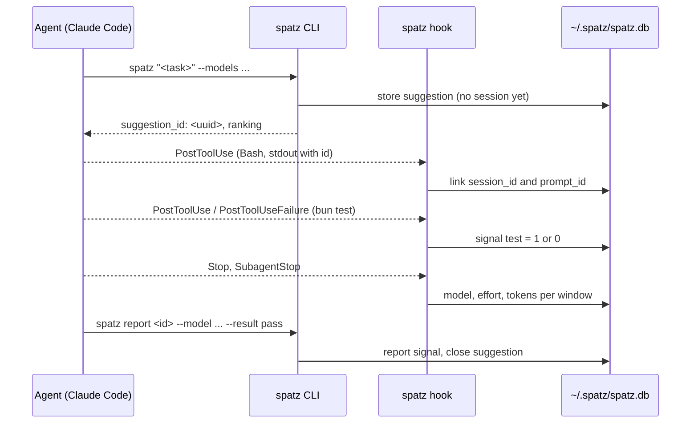

# Claude Code hooks for spatz

spatz learns which pair of model and effort succeeds. It needs results for that. Claude Code hooks give spatz these results without extra work from the agent: test and build results, and the models and tokens the session used. `spatz report` gives an explicit result. A report wins over all hook signals.

The hooks never block a session. `spatz hook` always exits with code 0 and prints nothing by default.
With `SPATZ_DEBUG=1`, the hook writes diagnostics to stderr. It still ignores all errors.
The snippet below also runs each hook with `"async": true`, so Claude Code does not wait for it.

spatz supports Claude Code and Codex CLI. For the command reference see [cli.md](cli.md).

## Install the hooks

### Marketplace plugin

Run these commands in Claude Code. See the [installation guide](installation.md) for runtime requirements:

```text
/plugin marketplace add lorenzh/spatz
/plugin install spatz@spatz
```

The plugin runs the four commands below with the same matchers and `async: true`.
It calls `sh "${CLAUDE_PLUGIN_ROOT}/bin/spatz"` using [Claude Code's plugin-root variable](https://code.claude.com/docs/en/hooks#reference-scripts-by-path).
The launcher prefers an installed `spatz` on `PATH`, then Bun, then Node's npx.
No separate CLI install is needed when either package runner is available.
The first run downloads about 60 MB. Package runners use the plugin's version.
Remove hand-written `spatz hook` entries from `~/.claude/settings.json` and project settings to avoid duplicate calls.
Keep unrelated hooks.
With the `spatz-mod` plugin, leave `record: auto` so the `spatz` hooks plugin handles recording.

### Manual settings

If you do not install the hooks plugin, use these settings instead.
With the mod and manual hooks, set the mod's `record: off`.
Automatic detection checks installed plugins only.

1. Make sure that `spatz` is on the `PATH` of a non-interactive shell. A shell alias is not enough. The [README](../README.md) shows a small wrapper script.
2. Select the settings file:
   - `~/.claude/settings.json` collects signals in all projects.
   - `<project>/.claude/settings.json` collects signals in one project.
3. Read the snippet below. Then merge it into the `hooks` key of that file.

```json
{
	"hooks": {
		"PostToolUse": [
			{
				"matcher": "Bash|Agent",
				"hooks": [{ "type": "command", "command": "spatz hook PostToolUse", "async": true }]
			}
		],
		"PostToolUseFailure": [
			{
				"matcher": "Bash",
				"hooks": [{ "type": "command", "command": "spatz hook PostToolUseFailure", "async": true }]
			}
		],
		"Stop": [
			{ "hooks": [{ "type": "command", "command": "spatz hook Stop", "async": true }] }
		],
		"SubagentStop": [
			{ "hooks": [{ "type": "command", "command": "spatz hook SubagentStop", "async": true }] }
		]
	}
}
```

spatz handles these four events. Other events do no harm, but they give no signal.

## What each event records

| Event | Condition | Records |
| --- | --- | --- |
| `PostToolUse` | Bash command is a spatz suggestion call | Links the session to the suggestion. See [Link a suggestion to a session](#link-a-suggestion-to-a-session). |
| `PostToolUse` | Bash command is a test or a build | Signal `test` or `build` with value 1 (success). |
| `PostToolUseFailure` | Bash command is a test or a build | Signal `test` or `build` with value 0 (failure). |
| `PostToolUse` | Tool is `Agent` | The subagent model from `tool_response.resolvedModel`, with 0 tokens and no effort. |
| `Stop` | Event has a `prompt_id` | Model, effort and tokens of the main session for this turn, read from the transcript. |
| `SubagentStop` | Always | Model, effort and tokens of the subagent, read from the subagent transcript. |

spatz ignores the `SubagentHandback` tool event and the second `UserPromptSubmit` that a subagent handback starts.

Signal weights: `test` 1.0, `build` 0.8, `report` 1.0. Without a report, spatz takes the newest value per signal kind. The quality is the weighted mean over the kinds. Without any signal, the suggestion has no outcome. Token usage alone does not make an outcome.

The hooks store no prompt text and no tool output. They store signals, model ids, efforts and token counts. See [privacy.md](privacy.md).

## Test and build detection

spatz reads the Bash command with regular expressions. It is not a shell parser.

| Kind | Commands |
| --- | --- |
| `test` | `bun test`, `npm test`, `pnpm test`, `yarn test`, the same with `run test`, `pytest`, `go test`, `cargo test`, `vitest`, `jest`, `make test`, `make check` |
| `build` | `bun build`, `npm build`, `pnpm build`, `yarn build`, the same with `run build`, `tsc`, `go build`, `cargo build`, `make`, `make build`, `make all` |

Rules:

- The command counts only when its exit status is the status of the test or build.
- In an `&&` chain, only the last segment counts. All segments before it must be `cd`, `pushd` or `export`.
- A pipe, `||`, `;`, `&`, a newline, backticks or `$(...)` make the status unclear. spatz then records no signal.
- spatz skips these prefixes before the command: `VAR=value` assignments, `rtk`, `rtk proxy`, `time`, `npx`, `bunx`, `pnpx`, `uv run`, `poetry run`, `python -m`, `python3 -m`.
- `make` counts only without a target or with `build`, `all` (build), `test`, `check` (test). `make clean` and other targets give no signal. Runs with `--collect-only`, `--co`, `--help`, `-h` or `--version` give no signal.
- A failed run gives no signal when it was interrupted or never reached the runner: the error text has `No such file or directory`, `permission denied` or `command not found` (for example `cd /missing && bun test`).
- Text in quotes is an argument, never a command. spatz ignores redirections like `2>&1`.

| Command | Result |
| --- | --- |
| `bun test` | test |
| `rtk bun test` | test (the RTK hook rewrites `bun test` to this) |
| `cd pkg && bun test` | test |
| `rtk proxy npx vitest run` | test |
| `make` | build |
| `npm run build && bun test` | none: `npm run build` is not a setup segment |
| `bun test 2>&1 \| tail` | none: the pipe hides the status |
| `bun test; echo done` | none |

## Link a suggestion to a session

`--session` links a suggestion when the CLI creates it.
The caller can also pass `--turn`, `--agent-id`, `--scope` and `--source claude-code-mod`.
See [cli.md](cli.md) for the flags.

Without explicit linking, the `PostToolUse` hook makes the link:

1. The agent runs `spatz "<task>" --models <list>` with the Bash tool.
2. The `PostToolUse` hook sees a Bash command whose segment starts with `spatz`, `<path>/spatz`, `npx [-y] @spatz/cli[@version]`, or `bunx @spatz/cli[@version]`. The first argument is not a subcommand or option.
3. spatz reads the suggestion id from the output. Text output gives the line `suggestion_id: <uuid>`. JSON output gives the field `"suggestion_id"`.
4. spatz stores `session_id` and `prompt_id` with the suggestion. Subagent events also supply `agent_id`.

Later signals and usage use the matching session and agent window.



Detection also accepts `rtk` and `rtk proxy` before these forms.
Plugin launcher paths can be quoted, including paths with spaces.
Keep suggestion output unfiltered so hooks can read the ID.
Without `--session`, these calls are not linked:

- `SPATZ_NO_JEV=1 spatz "<task>" ...` (an environment assignment before `spatz`)
- `bunx spatz "<task>" ...`
- `bun packages/cli/src/cli.ts "<task>" ...`

### What the agent does

1. Run `spatz "<task>" --models <the pairs you can use>`.
2. Use `ranking[0]`. spatz does not switch the model. The agent starts a subagent with that model and effort, or the user switches.
3. Do the task. Run tests and builds as plain commands, so the hooks can read the result.
4. At the end, run `spatz report <suggestion_id> --model <m> --effort <e> --result pass|partial|fail`.

## Time windows

A suggestion is open from its creation until the first of these events:

- `spatz report` for this suggestion.
- The next linked suggestion with the same session and agent id. The old window ends at the new suggestion.
- 2 hours without activity in that window. Each matching hook event resets this time.

Signals go to the open suggestion of the matching session and agent window. Token usage goes to the suggestion whose window holds the time stamp of each transcript message. Messages before the first suggestion of that window sequence count for no suggestion.

Hooks run async, so the link can arrive after `Stop` or `SubagentStop`. In that case spatz reads the transcripts again and puts each message in the correct window. A replayed or older transcript snapshot does not overwrite newer data.

## Subagents

Each subagent with an explicitly linked suggestion has its own windows.
Its suggestions do not close the main window or another subagent's window.
If an agent has no linked suggestion, its hooks use the main sequence as before.
If it has a linked suggestion, closure does not send later events back to the main sequence.

- `SubagentStop` reads `<session>/subagents/agent-<agent_id>.jsonl`. spatz sums the tokens per model.
- `PostToolUse` on the `Agent` tool records the subagent model from `resolvedModel`. This record has 0 tokens and no effort, because the `effort.level` in this event belongs to the main session.

Without a report, the used pair is the model with the most output tokens assigned to the suggestion. Its effort is the newest effort that a hook gave for that model. A report always sets the used pair.

## Mod and hooks together

The core accepts explicitly linked `claude-code-mod` suggestions in hook windows.
It does not exclude them by provenance. This supports separate routing and recording roles.
The mod routes through the CLI. Hooks can record signals and transcript usage for those suggestions.
Direct `spatz usage` records tokens without a transcript.

The mod can record usage directly, use the hooks, or select a recorder automatically when the hooks plugin is enabled. This avoids counting the same usage twice.

Do not send both transcript usage and direct mod usage for the same run.
The sources have different uniqueness keys, so the database keeps both.
When you install the hooks plugin, remove equivalent hand-written entries from `~/.claude/settings.json`.

## Limits

- Signal collection supports Claude Code and Codex CLI. Other agents can still use `spatz "<task>"` and `spatz report`.
- A hook cannot set the model or the effort. spatz only recommends.
- Test and build detection is a set of keyword patterns. It misses tools that are not in the list, and it skips commands with an unclear status.
- `Stop` fires once per turn, not once per task.
- Claude Code gives the main session model only in the transcript, not in the hook input.
- `UserPromptSubmit` and `SubagentStart` have no `effort.level`.
- spatz does not use `SessionEnd`.

## Codex CLI

Install the `spatz` Codex plugin:

```text
codex plugin marketplace add lorenzh/spatz
codex plugin add spatz@spatz
```

The plugin runs these hooks synchronously with a 10-second timeout. Codex skips plugin hooks until you review and trust them through `/hooks`.
[Codex supplies `PLUGIN_ROOT`](https://learn.chatgpt.com/docs/hooks#plugin-bundled-hooks), which points to the installed plugin directory. Remove hand-written `spatz hook … --agent codex` entries from `~/.codex/hooks.json` when installing the plugin, or events are recorded twice.
The plugin's `packages/codex-hooks/hooks/hooks.json` calls `sh "${PLUGIN_ROOT}/bin/spatz"`. Warm the pinned CLI once with `"<plugin root>/bin/spatz" --version`. Codex installs it at `~/.codex/plugins/cache/spatz/spatz/<version>`; confirm the path from Codex's plugin listing. Claude Code's installed plugin path is shown by `/plugin` and is usually `~/.claude/plugins/cache/<marketplace>/<plugin>/<version>`.
Direct `npx -y @spatz/cli --version` warms `@latest`, while Bun uses a separate cache. A cold plugin download can exceed Codex's 10-second hook timeout.

Without the plugin, use a hand-written `~/.codex/hooks.json` with plain `spatz` on `PATH`:

```json
{
	"hooks": {
		"PostToolUse": [{ "matcher": "Bash", "hooks": [{ "type": "command", "command": "spatz hook PostToolUse --agent codex", "timeout": 10 }] }],
		"Stop": [{ "hooks": [{ "type": "command", "command": "spatz hook Stop --agent codex", "timeout": 10 }] }]
	}
}
```

The plugin's `packages/codex-hooks/hooks/hooks.json` contains:

```json
{
	"hooks": {
		"PostToolUse": [{
			"matcher": "Bash",
			"hooks": [{ "type": "command", "command": "sh \"${PLUGIN_ROOT}/bin/spatz\" hook PostToolUse --agent codex", "timeout": 10 }]
		}],
		"Stop": [{
			"hooks": [{ "type": "command", "command": "sh \"${PLUGIN_ROOT}/bin/spatz\" hook Stop --agent codex", "timeout": 10 }]
		}]
	}
}
```

Review and trust the hook with `/hooks` in Codex. `codex exec` also enforces hook trust.

Codex hook input has no exit code. At turn end, spatz reads completed `CommandExecution` events from the rollout.
It reads the command from supported POSIX shell wrappers such as `/bin/bash -lc`.
Older rollouts use shell calls matched to outputs by call id.
Each result stays within its turn. Commands without an exit code give no signal.
The latest test and build results for that turn replace earlier results when Stop runs again.
These signals use source `Stop` and the turn ID. Replayed events do not add duplicate signals.
Codex has no `SubagentStop` or `PostToolUseFailure` hook.

Codex usage comes from the last `token_usage_record` for the turn.
An explicit `turn_token_usage` takes priority over `token_count` totals, which can lag after compaction.
If turn totals are absent, spatz uses the change in thread totals or sums per-response `usage` records.
Older rollouts use `event_msg` records with type `token_count`.
For these records, spatz takes the change in `info.total_token_usage` for the turn.
If any stored counter has a negative delta, spatz treats usage as unavailable.
For Codex, OpenAI `input_tokens` already includes `cached_input_tokens`. Claude reports these separately.
Spatz stores the inclusive input count in `input_tokens` and the cached subset in `cache_read_tokens` without subtraction.
It stores `cache_write_input_tokens` in `cache_creation_tokens`.
`output_tokens` already includes `reasoning_output_tokens`, so spatz counts reasoning once.
A rollout without usage does not replace an existing usage row.
The zero-token Codex rows in [#60](https://github.com/lorenzh/spatz/issues/60) came from `spatz report`, which records no tokens by design.
Those report rows are tracked separately from transcript usage. The earlier Codex transcript rows were correct.

### Hook diagnostics

Set `SPATZ_DEBUG=1` in the environment that starts Codex or Claude Code.
The hooks write fixed messages to stderr for recording errors or missing Codex rollout fields.
They also report when a linked Codex turn has no readable shell exit codes.
An empty turn can produce that message too.
Diagnostics contain no prompt text, command text or tool output.

For a database access error, check write access to `~/.spatz`.
SQLite also needs access to its WAL and shared-memory files.
In a sandboxed `codex exec` run, use `--add-dir ~/.spatz` to allow database writes.
Diagnostics do not change hook exit codes.
