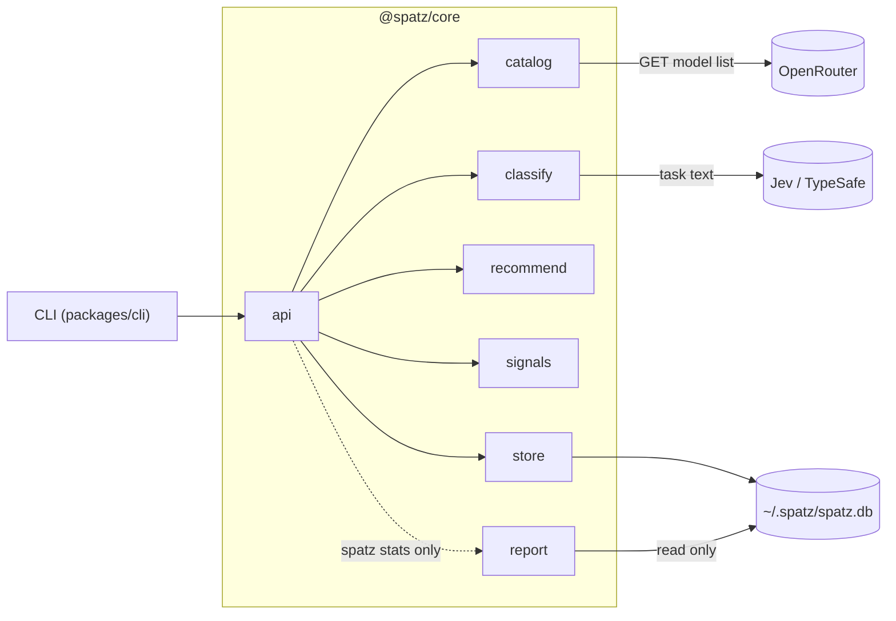
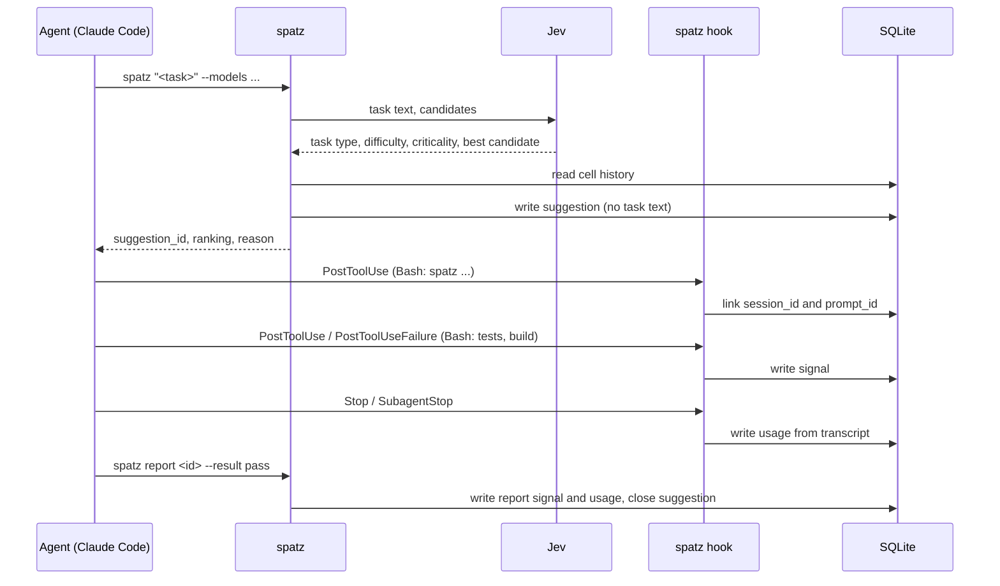

# How spatz works

spatz recommends a model and effort pair for one coding-agent task. It does not run the task and it does not switch models. This page explains the terms, the modules, the flow of one suggestion, the classification and the data model.

For the decision rule, read [recommendation.md](recommendation.md). For data that leaves the machine, read [privacy.md](privacy.md). For commands and hook setup, read [cli.md](cli.md) and [hooks.md](hooks.md).

## Terms

| Term | Meaning |
|---|---|
| Candidate | One pair of model and effort, for example `anthropic/claude-opus-5.5:high`. |
| Catalog | All candidates from the `--models` argument of one call, sorted by cost. spatz recommends only candidates from this list. |
| Suggestion | The result of one `spatz "<task>"` call: an id, a ranking of 1 to 3 candidates, a reason and the classification. |
| Usage | A record of which model ran for a suggestion, with its effort and token counts. It comes from `spatz usage`, `spatz report` or Claude Code and Codex CLI transcripts. |
| Signal | One observed result for a suggestion: a report value, a test run or a build run. |
| Attempt | One execution by an actual model/effort pair. It has a UUID and an ordinal within its suggestion. |
| Outcome | The quality of one attempt (0 to 1), computed from its signals, plus its actual pair. |
| Recovery chain | Attempts linked to one root attempt, including suggestions created with `--retry-of`. |
| Cell | The pair (task type, difficulty). spatz learns success rates per cell. |

Effort is one of `none`, `low`, `medium`, `high`, `xhigh`, `max`, `ultra`, in this cost order.

## Architecture

The CLI and core are separate packages. `packages/core` (`@spatz/core`) holds all logic. `packages/cli` (`@spatz/cli`) parses arguments, calls the core and formats the output. The CLI has no domain logic.

| Core module | Task |
|---|---|
| `api` | Use cases `suggest`, `usage`, `link`, `report`, `handleHook` and `stats`. It connects the other modules. The CLI calls only this module. |
| `catalog` | Parses `--models`, maps ids to OpenRouter ids, loads prices from OpenRouter with a 24 h cache and sorts the candidates by cost. |
| `classify` | Asks Jev the four questions. If Jev is not available, it uses keyword rules. It also holds the secret filter. |
| `recommend` | Computes the estimates per cell and picks the candidate. It is pure: no network, no files. |
| `signals` | Reads hook input: test and build commands, the suggestion id in `spatz` output, and token usage in Claude Code and Codex transcripts. It is pure. |
| `store` | The SQLite database through `bun:sqlite`: schema, migrations, writes and the `outcomes` view. |
| `report` | The `spatz stats` evaluation. It reads the SQLite file in read-only mode with bun:sqlite. |
| `contracts` | Shared types and start values. No logic. |

## Flow of one suggestion

1. The agent runs `spatz "<task>" --models <list>` through its Bash tool.
2. `catalog` builds the candidates and sorts them by cost.
3. `classify` sends the task text to Jev, or uses the keyword rules.
4. `recommend` reads the learned history of the task type and picks a candidate.
5. `store` saves the suggestion without the task text. The CLI prints the suggestion. The first output line is `suggestion_id: <id>`.
6. The Claude Code `PostToolUse` hook sees the `spatz` call. It reads the suggestion id from the output and links the suggestion to the session and prompt.
7. Later hook events bind signals and usage to their originating attempt using source identity or a trustworthy source-time window.
8. `spatz report` records the selected attempt's result and closes its suggestion window.
9. The next suggestion for the same task type uses the new outcomes.

A suggestion stays open until the first of these events:

- The next linked suggestion in the same session and agent window.
- A `spatz report` for this suggestion.
- 2 h without an event in that window.

Hooks only read and write locally. A hook never blocks the session: `spatz hook` ignores every error and always exits with code 0.

## Classification

### One Jev request with four questions

Jev is the classification model of TypeSafe AI. It gives typed answers with a probability per option. spatz uses the fixed model `jev-1.13.0`. One request asks four questions in parallel. The question texts and option descriptions are in German, as in the code.

| Question | Kind | Options |
|---|---|---|
| `task_type` | choice | The 17 task types below |
| `difficulty` | score over a rubric | `easy`, `medium`, `hard` |
| `criticality` | choice | `none`, `business_logic`, `security`, `data_integrity` |
| `best_candidate` | choice | Every candidate as `model:effort` |

For `best_candidate`, each option gets a short description. spatz takes it from `~/.spatz/descriptions.json`. If that file has no entry for the model, Jev gets the model name and its output price per million tokens.

The timeout is 1000 ms. The SDK does not retry.

### Task types

Taxonomy v2 has 17 flat types. Each type belongs to one family. spatz learns per type. The family only drives pooling (see [recommendation.md](recommendation.md)). v2 is a superset of v1, so old rows stay valid. The rules fallback without Jev still uses only the v1 types.

| Family | Task type | Jev description | Boundary rule |
|---|---|---|---|
| code | `code.bugfix` | Find and fix a bug in existing code. | A fix exists in the result; diagnosis only is `investigation`. |
| code | `code.feature` | Add behaviour with new code. | A UI task is `code.feature` when acceptance is functional (data saved, validation, API). New code with its own tests is `code.feature`. |
| code | `code.refactor` | Change the code structure without changing its behaviour. | If behaviour changes it is `code.feature` or `code.bugfix`. |
| code | `code.test` | Write or fix tests for existing code without changing the code under test. | A failing test caused by a bug in the code is `code.bugfix`. |
| code | `code.explain` | Answer a question about existing code without producing a document or a change. | A written document is `writing`; finding the cause of a fault is `investigation`. |
| code | `investigation` | Find the cause of a fault or unexpected behaviour without fixing it; the result is a diagnosis. | If the task also asks for the fix it is `code.bugfix`; gathering outside facts is `research`. |
| review | `review` | Review or verify someone else's work: code, design, document or data. | Covers every artefact type. |
| planning | `spec` | Write or change requirements, acceptance criteria or an interface contract that others implement. | Other prose is `writing`. |
| planning | `planning` | Decide the steps, architecture or approach for this project without producing the work. | Gathering facts or options is `research`. |
| ops | `ops` | Change or diagnose infrastructure, CI, deployment or configuration. | Application code is `code.*`; a CI failure caused by a code bug is `code.bugfix`. |
| design | `design.ui` | Design or build a user interface: screens, layouts, components, flows or interactive prototypes. | Acceptance is look, layout or interaction; built in Figma or in code. |
| design | `design.visual` | Create visual assets without interaction: graphics, illustrations, logos, diagrams, slides or image edits. | A chart from given numbers is `design.visual`; from analysed data it is `data`. |
| design | `design.3d` | Create or change 3D content: models, meshes, scenes, materials or animations. | Includes three.js, Blender scripts and CAD. |
| prose | `writing` | Write or edit prose for people: documentation, articles, reports, messages or marketing text. | Gathering and comparing facts is `research`. |
| prose | `research` | Find, compare and summarise information or options; the result is knowledge, not a change. | A report whose main work is gathering is `research`; polishing existing text is `writing`. |
| data | `data` | Analyse data: query, aggregate, chart or interpret a dataset; the result is a finding or a figure. | Building a pipeline or a schema is `code.feature`. |
| other | `other` | None of the other options fits. | Live data only. |

### Difficulty rubric

The output and database use English values, ordered `easy < medium < hard`.

| Value | Rubric |
|---|---|
| `easy` | One clear deliverable with little context. |
| `medium` | Several places, parts or constraints; some analysis. |
| `hard` | Many parts, an open goal, a design decision, an unclear cause or much context. |

spatz takes the level with the highest probability. If that probability is below 0.5, spatz moves one level up. `hard` stays `hard`. An uncertain answer thus gets the safer level.

### Criticality

| Value | Meaning |
|---|---|
| `none` | A normal change without the risks below. Visible functional errors also belong here. |
| `business_logic` | Money, prices, billing, contracts or legal rules. |
| `security` | Login, permissions, secrets or vulnerabilities. |
| `data_integrity` | Stored data: migrations, deletion or protection against data loss. |

The descriptions are narrow on purpose. A critical task gets the most expensive pair. Only a cheaper pair with strong proof can win. In a spike, a broader description made Jev rate an off-by-one fix in a pagination helper as `business_logic` with probability 0.99. With that description, almost every bug fix is critical. So `none` explicitly includes visible errors.

### Rule fallback

spatz uses keyword rules instead of Jev in these cases:

| `fallback_reason` | Cause |
|---|---|
| `opt_out` | `SPATZ_NO_JEV=1` or `.spatz.json` with `{"jev": false}` |
| `secret` | The secret filter found a secret in the task text |
| `no_key` | `TYPESAFE_AI_API_KEY` is not set |
| `timeout` | Jev did not answer in 1000 ms |
| `auth` | Jev rejected the key |
| `rate_limit` | Jev returned HTTP 429 |
| `error` | Any other error |

The rules give these values:

- `task_type` is `other`.
- `difficulty` is `medium`.
- `criticality` comes from keywords in the task text. spatz checks the `security` words first, for example `auth` or `password`. Then it checks the `data_integrity` words, for example `migration`. Then it checks the `business_logic` words, for example `payment`. The lists include German words. The check is a substring match, so `author` counts as `auth`.
- There is no best candidate.

The suggestion output shows `fallback_used: true`. The database stores `fallback_reason` on each recommendation.
`spatz stats` shows the counts for each reason in text and JSON.
Successful Jev classifications store `null`. Legacy rows also contain `null` because their reasons cannot be recovered.

## Data model

spatz keeps one SQLite file at `~/.spatz/spatz.db`. SQLite runs in WAL mode with a busy timeout of 5000 ms. Each session starts its own `spatz` processes, so several processes can write at the same time. A session link reads and then writes, so it runs in an `IMMEDIATE` transaction. It takes the write lock first, so the busy timeout also covers it and a concurrent hook cannot break its read snapshot.

| Table or view | Content |
|---|---|
| `suggestions` | One row per recommendation with its classification, ranking and strategy. Also stores timestamps, flags and attribution fields. No task text. |
| `usages`, `signals` | Frozen measurements and signals for legacy suggestions. |
| `attempts` | Execution UUID, ordinal, start key, actual pair, root and closure times. |
| `attempt_bindings` | External prompt, turn, call, message and start IDs linked to attempts. |
| `attempt_events` | Derived signals and usage with source identity, revision and binding state. No raw input. |
| `attempt_outcomes` | Quality evidence and four token totals per attempt. |
| `legacy_outcomes` | The unchanged pre-attempt outcome query over frozen legacy rows. |
| `outcomes` | Legacy outcomes plus attempt outcomes. See [recommendation.md](recommendation.md#quality-and-success). |
| `usage_totals` | Legacy and current authoritative usage, with nullable attempt IDs and normalized cost fields. |
| `dispatches` | One observation per session/agent pair, linked to its attempt through that pair. |
| `usage_scopes` | One watermark per transcript scope. See below. |
| `failures` | Parse and hook failures with kind, event, timestamp, session id and turn key. No transcript text or error messages. |

### Normalized tokens and cost

`input_tokens` means uncached input for every source.
`cache_read_tokens` and `cache_creation_tokens` hold separate input counts.
`output_tokens` includes reasoning tokens once.
Missing counters stay `null`. If any counter is null, `tokens_complete` is `0`.
Claude subagent transcript `output_tokens` are stale streaming snapshots.
Hooks store these estimates with `tokens_complete = 0`, even when all four counters are present.
Main-session transcripts keep the counter-based check.
Mod measurements replace hook estimates for the same session and agent.
Reports and Agent tool events do not measure tokens. Their counters are null.

Suggestions capture four OpenRouter rates per candidate model in `price_snapshot`.
`price_date` is the capture time in epoch milliseconds.
Catalog price changes do not alter the snapshot.
Each `usages` row stores `cost_usd` and `cost_source`:

- `reported`: the caller supplied a harness cost through `spatz usage --cost-usd`.
- `priced`: spatz multiplied the four counters by the model's stored rates and summed them.
- `unavailable`: no usable price snapshot or required rate exists. `cost_usd` is null.

For pricing, null counters contribute zero. They still mark the row incomplete.
Without a reported cost, an entirely unmeasured row has unavailable cost.
A zero counter needs no rate. A positive counter does.
Without a reported cost, a used model outside the snapshot has unavailable cost.
Prices are USD per token. Reported cost takes priority over calculated cost.

New usage rows have `tokens_schema = 2`.
The v6 migration flags pre-change Codex rows with `tokens_schema = 1` and keeps their counts unchanged.
It uses the suggestion's `agent = 'codex'` or a transcript row with an `openai/` model ID.
All USD aggregates exclude schema-1 rows and rows with `tokens_complete = 0`.
Historical rows have unavailable cost and unknown completeness.
Token reports keep the historical counts. These can mix inclusive and uncached Codex input.

The `usage_totals` view returns null cost for incomplete or schema-1 usage across legacy and attempt rows.
Stats count these rows in `incomplete` and retain their token totals as possible lower bounds.
The count uses aggregated usage rows, not individual transcript messages.
Replaced hook estimates no longer contribute to the count.
Stats aggregate each measurement once before joining outcomes.
Pending usage without a suggestion contributes no tokens or cost.
See [CLI stats](cli.md#spatz-stats) for the current totals.

### Migrations

`PRAGMA user_version` holds the schema version. Each time spatz opens the store, it applies the missing migrations in order. `spatz "<task>"`, `spatz usage`, `spatz link`, `spatz report` and `spatz hook` open the store. `spatz stats` opens the store to run migrations, then reads it through a read-only bun:sqlite connection.

All pending migrations run in one `IMMEDIATE` transaction. spatz reads the version again inside the transaction, so two processes cannot apply the same migration twice.

Before the first migration write, a separate read-only connection creates a backup with `VACUUM INTO`. The write lock prevents other writers from changing the database during backup and migration. A failure rolls back all pending migrations. See [backup and restore](configuration.md#database-backup-and-restore) for retention and downgrade behavior.

| Version | Change |
|---|---|
| 1 | Tables `suggestions`, `usages`, `signals` and the view `outcomes` |
| 2 | Table `usage_scopes` |
| 3 | Nullable routing and attribution fields. A unique index prevents duplicate direct signals per turn. |
| 4 | English difficulty values, probability keys and pooling reasons. Row counts and outcomes stay unchanged. |
| 5 | Nullable `suggestions.fallback_reason` and the `failures` table. Existing rows and outcomes stay unchanged. |
| 6 | Suggestion price snapshots, nullable token counters, completeness and schema flags, USD cost and its source. |
| 7 | Dispatch observations keyed by session and agent. |
| 8 | Attempt ledger and shared event binding. Existing suggestions become closed legacy rows. |
| 9 | Mark stored Claude subagent transcript estimates incomplete and refresh cost views. No new columns. |

`SCHEMA_V3` is the third entry in `MIGRATIONS`.
`SCHEMA_VERSION` stays equal to `MIGRATIONS.length`.
The migration adds columns without replacing existing rows or the outcome view.
Existing suggestions keep their outcomes. Their new fields are `null`.

`SCHEMA_V4` converts `leicht`, `mittel` and `schwer` to `easy`, `medium` and `hard`.
It updates `suggestions.difficulty`, `probabilities.difficulty` keys and generated pooling labels in `reason`.
Ranking entries contain no difficulty field. The migration preserves them and all unrelated JSON fields.
Store reads and writes accept the old values. Classification and recommendation also accept legacy difficulty inputs.
Stats group old and new spellings into the same cell, including `stats --by scope`.
English probability keys take precedence when both spellings exist.

`SCHEMA_V5` is an array of single SQL statements in `MIGRATIONS`.
The existing migration transaction covers both statements and the version update.
If either statement fails, SQLite rolls back the entire migration.

`SCHEMA_V6` also uses single-statement entries in the same transaction.
It rebuilds `usages` to allow null counters and preserves rowids and all existing values.
The migration recreates the unchanged `outcomes` view and keeps usage watermarks intact.
If any statement fails, SQLite rolls back the table rebuild and the version update.

`SCHEMA_V8` uses single SQL statements in the migration transaction.
It closes existing suggestions and marks them as legacy.
It preserves the exact previous outcome query as `legacy_outcomes`.
Signals, usages, rowids, usage watermarks and price snapshots stay unchanged.
Late events for legacy suggestions are dropped with a local diagnostic.
They cannot fall through to newer suggestions.
Historical retry counts and first-pair costs remain unknown.

### Failure recording

If no assistant message has a usable timestamp for the prompt id, Claude `Stop` counts a parse failure.
`SubagentStop` checks the subagent transcript in the same way.
If the rollout has no matching turn context with a model, Codex `Stop` counts a parse failure.
Missing files, unreadable files and parser exceptions also count as parse failures.
Transcript refreshes after delayed links use the same counters.
These checks do not change suggestion windows or signal attribution.

The `failures` table rejects duplicates for the same kind, event, session and turn key.
For subagent parsing, the turn key is the agent id.
For malformed hooks without usable ids, each failure adds a row.
Hooks still swallow errors and exit successfully. If SQLite cannot record a failure, the hook continues without a counter.

If the CLI fails to start, plugin launchers cannot use SQLite.
For each failed hook invocation, the outer launcher appends `1` and a newline to `$HOME/.spatz/launcher-failures`.
A nested launcher does not append another marker. The launcher preserves stdin, stdout and the exit code.
The marker contains no hook input or error text. Failed non-hook commands keep their existing stderr and exit behavior.
The API counts markers for `spatz stats` without consuming them.
See [configuration.md](configuration.md#launcher-failures) for retention and write failures.

### Direct attribution

| Suggestion field | Values and meaning |
| --- | --- |
| `scope` | `step`, `turn`, `subagent`, `session`, `escalate` or `null`. The caller's routing decision scope. |
| `agent` | `claude-code`, `claude-code-mod`, `codex` or `null`. The caller's provenance. |
| `turn_id` | The initial turn id, or `null`. A suggestion can cover later turns too. |
| `agent_id` | The subagent id, or `null` for the main window. |

`--session` links a suggestion at creation. `--turn` and `--agent-id` store direct attribution.
The Bash hook remains available for calls without explicit linking.
No task text enters these fields.

Direct recorders preserve source identity before adding usage.
The mod registers each execution segment before the request starts.
Start replay returns the same attempt. A changed pair starts a new attempt.
Direct reports select an attempt rather than replacing a suggestion-wide outcome.
Usage alone never creates quality evidence.

### Attempts and recovery chains

A suggestion opens attempt 1 with an unknown actual pair.
The first execution or report fills that pair. The recommendation alone cannot fill it.
Explicit starts, pair switches, new dispatches and work after a report start new attempts.
A failed test followed by a fix stays in the same attempt.
A report closes the attempt and suggestion window. Late evidence can still bind to it.

Each chain uses its first attempt's `root_id`.
`suggest --retry-of <suggestion_id>` joins that suggestion's chain.
Unlinked suggestions and separate reviews start separate chains.
A report or finalized Stop evidence with quality at least `successQuality` closes the chain successfully.
Intermediate test results do not close it.
The next unlinked suggestion in the same session/agent closes an unsuccessful chain.
The chain view also derives idle expiry at read time.
Late evidence and report corrections recompute the chain result.

Execution tokens stay with their attempts. Decision cost counts the chain once under its root pair.
For costs `10 → 20 → 70`, the root decision costs `100`.
Failed completed chains also contribute cost.
Main-session orchestration usage has a suggestion ID and a null attempt ID.
It contributes to chain cost and remains identifiable as overhead.
A chain with any incomplete or schema-1 usage has a null cost and exposes its `incomplete` count.
Cost-per-success consumers exclude these chains from both cost and success inputs.
A cost-per-success consumer divides by successful eligible chains. With zero eligible successes, the result is null.

### Session and agent windows

Each `(session_id, agent_id)` has its own sequence of suggestion windows.
A null `agent_id` selects the main sequence.
A new subagent suggestion cannot close another agent's suggestion.
The routing label `scope` does not select the sequence.

Signals and usage use the same binding rule:

- `bound`: source identity selects the attempt.
- `window`: trustworthy source time selects one compatible window.
- `pending`: no safe target exists. The event receives no quality credit.

Existing bindings restrict candidates even after their windows close.
An old prompt cannot select a newer suggestion through its timestamp.
Exact call, message and start bindings work without timestamps.
Without known identity or trustworthy source time, the event stays pending.
Receipt time never substitutes for source time.

Windows are half-open. They end at closure or idle expiry.
Late events cannot extend the current idle window.
New links and transcripts reconcile pending events and provisional window bindings together.
The store moves signals and usage in one transaction. Exact bindings stay fixed.
Conflicting window credit returns to pending. Older transcripts cannot erase newer evidence.

An Agent tool call in source order establishes delegation.
Main-session test/build signals then select the latest closed delegate in that suggestion window.
The selected attempt stays fixed when later reports arrive.
Main-session self-fixes follow this same fallback unless explicit attempt identity overrides it.
The orchestrator's pair does not replace the worker's pair.
See [hooks.md](hooks.md) for recorder ownership and identity limits.
