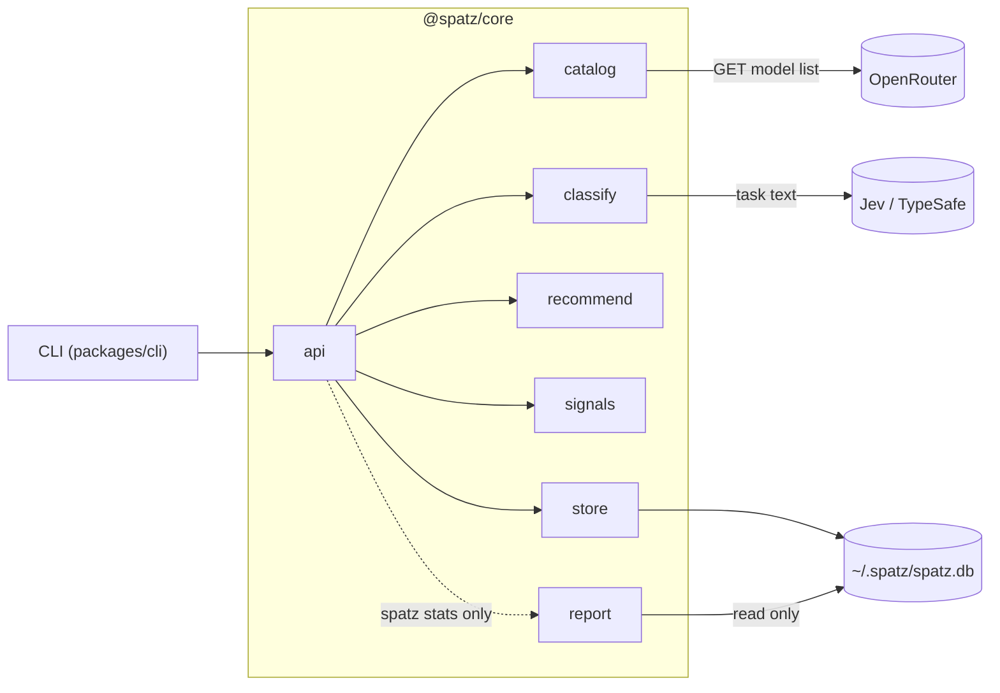
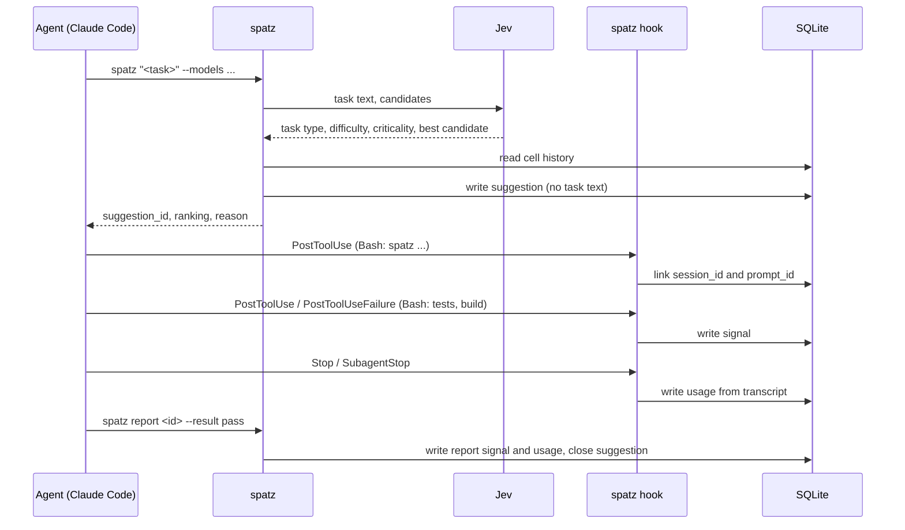

# How spatz works

spatz recommends a model and effort pair for one coding-agent task. It does not run the task and it does not switch models. This page explains the terms, the modules, the flow of one suggestion, the classification and the data model.

For the decision rule, read [recommendation.md](recommendation.md). For data that leaves the machine, read [privacy.md](privacy.md). For commands and hook setup, read [cli.md](cli.md) and [hooks.md](hooks.md).

## Terms

| Term | Meaning |
|---|---|
| Candidate | One pair of model and effort, for example `anthropic/claude-opus-5.5:high`. |
| Catalog | All candidates from the `--models` argument of one call, sorted by cost. spatz recommends only candidates from this list. |
| Suggestion | The result of one `spatz "<task>"` call: an id, a ranking of 1 to 3 candidates, a reason and the classification. |
| Usage | A record of which model ran for a suggestion, with its effort and token counts. It comes from `spatz report` or from Claude Code and Codex CLI transcripts. | | Usage | A record of which model ran for a suggestion, with its effort and token counts. It comes from `spatz usage`, `spatz report` or Claude Code transcripts. |
| Signal | One observed result for a suggestion: a report value, a test run or a build run. |
| Outcome | The quality of one suggestion (0 to 1), computed from its signals, plus the pair that was actually used. |
| Cell | The pair (task type, difficulty). spatz learns success rates per cell. |

Effort is one of `low`, `medium`, `high`, `xhigh`, `max`, in this cost order.

## Architecture

The CLI and core are separate packages. `packages/core` (`@spatz/core`) holds all logic. `packages/cli` (`@spatz/cli`) parses arguments, calls the core and formats the output. The CLI has no domain logic.

| Core module | Task |
|---|---|
| `api` | Use cases `suggest`, `usage`, `report`, `handleHook` and `stats`. It connects the other modules. The CLI calls only this module. |
| `catalog` | Parses `--models`, maps ids to OpenRouter ids, loads prices from OpenRouter with a 24 h cache and sorts the candidates by cost. |
| `classify` | Asks Jev the four questions. If Jev is not available, it uses keyword rules. It also holds the secret filter. |
| `recommend` | Computes the estimates per cell and picks the candidate. It is pure: no network, no files. |
| `signals` | Reads hook input: test and build commands, the suggestion id in `spatz` output, and token usage in Claude Code and Codex transcripts. It is pure. |
| `store` | The SQLite database through `bun:sqlite`: schema, migrations, writes and the `outcomes` view. |
| `report` | The `spatz stats` evaluation. DuckDB reads the SQLite file in read-only mode. spatz loads DuckDB only for this command. |
| `contracts` | Shared types and start values. No logic. |

## Flow of one suggestion

1. The agent runs `spatz "<task>" --models <list>` through its Bash tool.
2. `catalog` builds the candidates and sorts them by cost.
3. `classify` sends the task text to Jev, or uses the keyword rules.
4. `recommend` reads the learned history of the task type and picks a candidate.
5. `store` saves the suggestion without the task text. The CLI prints the suggestion. The first output line is `suggestion_id: <id>`.
6. The Claude Code `PostToolUse` hook sees the `spatz` call. It reads the suggestion id from the output and links the suggestion to the session and prompt.
7. Later hook events of the same session add signals and usage to the open suggestion.
8. `spatz report` adds an explicit result and closes the suggestion.
9. The next suggestion for the same task type uses the new outcomes.

A suggestion stays open until the first of these events:

- The next linked suggestion in the same session and agent window.
- A `spatz report` for this suggestion.
- 2 h without an event in that window.

Hooks only read and write locally. A hook never blocks the session: `spatz hook` ignores every error and always exits with code 0.

## Classification

### One Jev request with four questions

Jev is the classification model of TypeSafe AI. It gives typed answers with a probability per option. spatz uses the fixed model `jev-1.13.0`. One request asks four questions in parallel. The question texts and option descriptions are in German, as in the code.

| Question | Kind | Options |
|---|---|---|
| `task_type` | choice | The eight task types below |
| `difficulty` | score over a rubric | `leicht`, `mittel`, `schwer` |
| `criticality` | choice | `none`, `business_logic`, `security`, `data_integrity` |
| `best_candidate` | choice | Every candidate as `model:effort` |

For `best_candidate`, each option gets a short description. spatz takes it from `~/.spatz/descriptions.json`. If that file has no entry for the model, Jev gets the model name and its output price per million tokens.

The timeout is 1000 ms. The SDK does not retry.

### Task types

| Task type | Meaning (translated from the Jev description) |
|---|---|
| `code.bugfix` | Find and fix an error in existing code. |
| `code.feature` | New code adds a function. |
| `code.refactor` | The code changes its structure. The behavior stays the same. |
| `code.explain` | The agent explains code and changes nothing. |
| `review` | The agent checks work of others: a review or a verification. |
| `spec` | The agent writes or changes a specification. |
| `planning` | The agent plans steps, architecture or approach without code. |
| `other` | No other option fits. |

### Difficulty rubric

The values stay German in the output and the database.

| Value | Meaning | Rubric |
|---|---|---|
| `leicht` | easy | A clear task with little context. One place or one topic. |
| `mittel` | medium | Several places or topics. The approach needs some analysis. |
| `schwer` | hard | Many parts, an unclear cause, a design decision or much context. |

spatz takes the level with the highest probability. If that probability is below 0.5, spatz moves one level up. `schwer` stays `schwer`. An uncertain answer thus gets the safer level.

### Criticality

| Value | Meaning |
|---|---|
| `none` | A normal change without the risks below. Visible functional errors also belong here. |
| `business_logic` | Money, prices, billing, contracts or legal rules. |
| `security` | Login, permissions, secrets or vulnerabilities. |
| `data_integrity` | Stored data: migrations, deletion or protection against data loss. |

The descriptions are narrow on purpose. A critical task gets the most expensive pair. Only a cheaper pair with strong proof can win. In a spike, a broader description made Jev rate an off-by-one fix in a pagination helper as `business_logic` with probability 0.99. With that description, almost every bug fix is critical. So `none` explicitly includes visible errors.

### Rule fallback

spatz uses keyword rules instead of Jev in these cases:

| `fallback_reason` | Cause |
|---|---|
| `opt_out` | `SPATZ_NO_JEV=1` or `.spatz.json` with `{"jev": false}` |
| `secret` | The secret filter found a secret in the task text |
| `no_key` | `TYPESAFE_AI_API_KEY` is not set |
| `timeout` | Jev did not answer in 1000 ms |
| `auth` | Jev rejected the key |
| `rate_limit` | Jev returned HTTP 429 |
| `error` | Any other error |

The rules give these values:

- `task_type` is `other`.
- `difficulty` is `mittel`.
- `criticality` comes from keywords in the task text. spatz checks the `security` words first, for example `auth` or `password`. Then it checks the `data_integrity` words, for example `migration`. Then it checks the `business_logic` words, for example `payment`. The lists include German words. The check is a substring match, so `author` counts as `auth`.
- There is no best candidate.

The output shows `fallback_used: true`. The reason itself is not in the output and not in the database.

## Data model

spatz keeps one SQLite file at `~/.spatz/spatz.db`. SQLite runs in WAL mode with a busy timeout of 5000 ms. Each session starts its own `spatz` processes, so several processes can write at the same time.

| Table or view | Content |
|---|---|
| `suggestions` | One row per recommendation with its classification, ranking and strategy. Also stores timestamps, flags and attribution fields. No task text. |
| `usages` | Model, effort and token counts per suggestion. `source` is `report`, `transcript`, `subagent`, `agent_tool` or `claude-code-mod`. A report usage also holds `rounds` and `note`. |
| `signals` | One row per signal: kind (`report`, `test`, `build`), value, weight, source and time. |
| `outcomes` | A view, not a table. It computes quality and the used pair per suggestion. See [recommendation.md](recommendation.md#quality-and-success). |
| `usage_scopes` | One watermark per transcript scope. See below. |

### Migrations

`PRAGMA user_version` holds the schema version. Each time spatz opens the store, it applies the missing migrations in order. `spatz "<task>"`, `spatz usage`, `spatz report` and `spatz hook` open the store. `spatz stats` reads the file through DuckDB and does not migrate. Each migration runs in its own `IMMEDIATE` transaction. spatz reads the version again inside the transaction, so two processes cannot apply the same migration twice.

| Version | Change |
|---|---|
| 1 | Tables `suggestions`, `usages`, `signals` and the view `outcomes` |
| 2 | Table `usage_scopes` |
| 3 | Nullable routing and attribution fields. A unique index prevents duplicate direct signals per turn. |

`SCHEMA_V3` is the third entry in `MIGRATIONS`.
`SCHEMA_VERSION` stays equal to `MIGRATIONS.length`.
The migration adds columns without replacing existing rows or the outcome view.
Existing suggestions keep their outcomes. Their new fields are `null`.

### Direct attribution

| Suggestion field | Values and meaning |
| --- | --- |
| `scope` | `step`, `turn`, `subagent`, `session`, `escalate` or `null`. The caller's routing decision scope. |
| `agent` | `claude-code`, `claude-code-mod`, `codex` or `null`. The caller's provenance. |
| `turn_id` | The initial turn id, or `null`. A suggestion can cover later turns too. |
| `agent_id` | The subagent id, or `null` for the main window. |

`--session` links a suggestion at creation. `--turn` and `--agent-id` store direct attribution.
The Bash hook remains available for calls without explicit linking.
No task text enters these fields.

Direct usage stores each run's `turn_id` and the suggestion's `agent_id` in `usages`.
Its source is `claude-code-mod`. Its `scope_key` is the turn id.
The existing uniqueness rule covers `(suggestion_id, source, scope_key, model)`.
Repeated submissions replace one row. Follow-up turns keep separate rows.
The API reads no transcript for direct usage.

Direct reports store `turn_id` and `agent_id` in `signals` and report usage rows.
The signal index covers `(suggestion_id, source, turn_id, kind)` for non-null turns.
The outcome view still aggregates one outcome per suggestion.
Usage alone never creates an outcome.

### Session and agent windows

Each `(session_id, agent_id)` has its own sequence of suggestion windows.
A null `agent_id` selects the main sequence.
A new subagent suggestion cannot close a main suggestion or another agent's suggestion.
Late links close only earlier suggestions in their own sequence.
The routing label `scope` does not select the sequence.

Hooks select the sequence from the event's agent id.
If that agent has no linked suggestions, hooks use the main sequence for legacy attribution.
If that agent has any linked suggestion, hooks use only its sequence, even after closure.
`Stop` reads the main sequence. `SubagentStop` reads the subagent sequence.
See [hooks.md](hooks.md) for the planned split between routing and recording.

### Usage scopes and the atomic rewrite

A usage scope is one transcript part: one prompt of the main session (`transcript`, key `prompt_id`) or one subagent (`subagent`, key `agent_id`). The `Stop` and `SubagentStop` hooks read the whole scope each time.

Hooks run in the background. Their events can arrive late, twice or in the wrong order. A late link can also shorten the time window of an earlier suggestion. So spatz does not add usage rows. It rewrites the whole scope:

1. spatz reads the watermark of the scope: the time of the last message and the message count.
2. If the new snapshot is older, spatz skips it. Older means an earlier last message, or the same last message with fewer messages.
3. spatz deletes all usage rows of the scope for the suggestions of this session.
4. spatz splits the messages by the suggestion windows of the selected agent sequence. It writes one usage row per suggestion and model.
5. spatz saves the new watermark.

All five steps run in one `IMMEDIATE` transaction. A compacted transcript has fewer messages, so the time of the last message decides first.

The time window of a suggestion starts at its creation. It ends at the earliest of these times: its closure, or 2 h after its last event.
